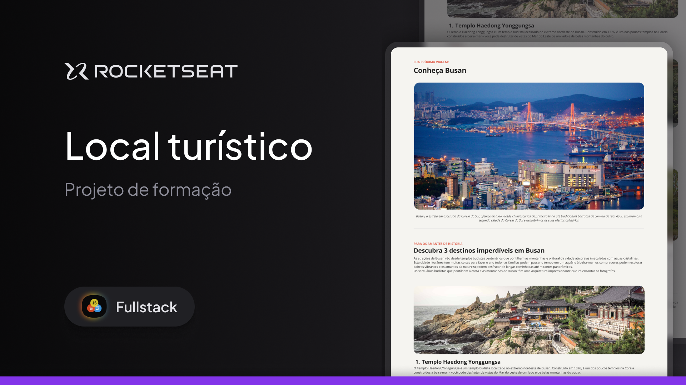

  

  Projeto de uma página web com informações sobre um ponto turístico, desenvolvido durante as aulas de HTML e CSS.

  <a href="#-tecnologias-usadas">Tecnologias Usadas</a>&nbsp;&nbsp;&nbsp;|&nbsp;&nbsp;&nbsp;
  <a href="#-projeto">Projeto</a>&nbsp;&nbsp;&nbsp;|&nbsp;&nbsp;&nbsp;
  <a href="#memo-licença">Licença</a>

  

 

  

---

## 🚀 Tecnologias Usadas

Durante o desenvolvimento deste projeto, foram trabalhados os seguintes conceitos:

- Estruturação de conteúdo com **HTML**
- Estilização com **CSS**
- Utilização de **fontes personalizadas**
- Definição de **espaçamentos** e **alinhamentos**
- Inserção de **imagens**
- Criação de **listas desordenadas**
- Customização de **cores e pesos tipográficos**

## 💡 Projeto

Este projeto consiste em uma página web informativa sobre um local turístico específico. A proposta foi exercitar os conhecimentos adquiridos em **HTML e CSS**, aplicando práticas como organização de conteúdo, uso de imagens, estilos personalizados e tipografia.

## :memo: Licença

Este projeto está sob a licença MIT. 
